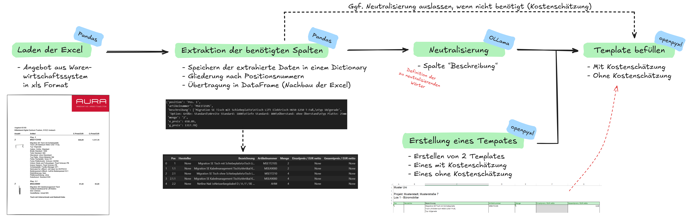

# Erstellung des Mengengerüsts

Das Mengengerüst ist eine von Aura erstellte Excel-Tabelle, die Positionsnummern, Maßangaben, Farben und Mengenangaben der Möbelstücke enthält. Sie wird in zwei Szenarien verwendet: Für die interne Nutzung enthält sie geschätzte Preisangaben aus dem Warenwirtschaftssystem und benötigt keine Neutralisierung. Für die Weitergabe an Unternehmen zur Ausschreibung müssen Artikelnummern entfernt und die Produktbeschreibungen neutralisiert werden, um einen fairen Wettbewerb zu gewährleisten. Zudem müssen die meisten Felder gesperrt werden, sodass nur die Preisspalte bearbeitet werden kann.

  

 

 

(<a href="README.md">back to main</a>)

## Überblick

Die wesentlichen Schritte lassen sich wie folgt zusammenfassen:

1. **Export der Produktdaten**  
   Die Produktdaten werden als XLS-Datei aus dem Warenwirtschaftssystem exportiert.

2. **Laden der Daten in Pandas**  
   Die XLS-Datei wird mithilfe von Python in ein Pandas DataFrame geladen.

3. **Datenvorverarbeitung**  
   Mit Pandas-Befehlen werden verschiedene Vorverarbeitungsschritte durchgeführt, um die relevanten Informationen aus der XLS-Datei zu extrahieren und in einem Dictionary zu speichern.

4. **Neutralisierung der Bezeichnungen**  
   Die Texte unter dem Schlüssel „Bezeichnung“ werden mithilfe eines <a href="https://ollama.com/">**OLLama-Sprachmodells**</a> neutralisiert (<a href="Explore\Technischer_Vorbeschrieb">weitere Details dazu bei den Technische Vorbeschrieben</a>), sodass keine Rückschlüsse auf den Hersteller möglich sind.

5. **Erstellung der Zieltabelle**  
   Der Inhalt des Dictionaries wird in ein Pandas DataFrame übertragen, das der Struktur der Zieltabelle entspricht. Es gibt zwei verschiedene Tabellenstrukturen:
   - **Für die interne Kostenschätzung**:  
     (Positionsnummer, Hersteller, Bezeichnung (nicht neutralisiert), Artikelnummer, Menge, Einzelpreis, Gesamtpreis)
   - **Für die Bewerber**:  
     (Positionsnummer, Bezeichnung (neutralisiert), Menge, Einzelpreis (manuell befüllbar), Gesamtpreis (Formel zur Berechnung hinterlegt))

6. **Export und Layout-Anpassung**  
   Mithilfe von <a href="https://openpyxl.readthedocs.io/en/stable/">**Openpyxl**</a> wird das Pandas DataFrame in eine XLSX-Datei exportiert. Dabei wird das optische Layout bearbeitet, Excel-Formeln integriert und die Tabelle gesperrt, um nur die Bearbeitung der relevanten Felder durch die Bewerber zu ermöglichen.
