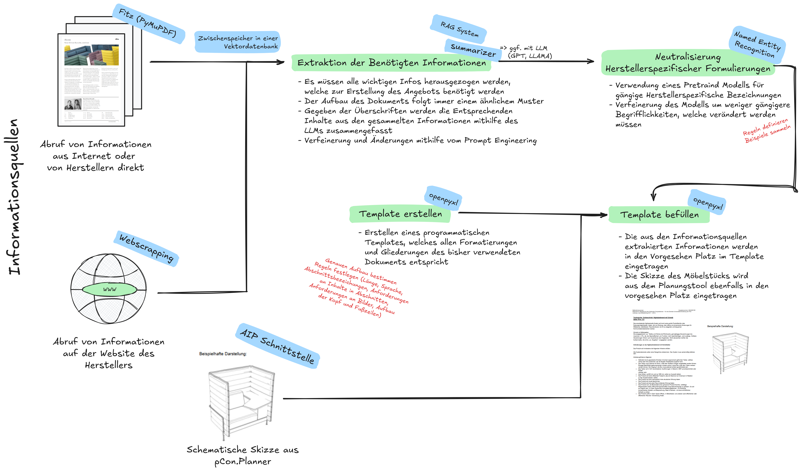

# Erstellung des Technischen Vorbeschriebs

  

 

## Überblick

Die wesentlichen Schritte lassen sich wie folgt zusammenfassen:

<b>Abruf von Informationen: </b>

Die Informationen werden entweder aus dem Internet, von Herstellern direkt oder von 
Hersteller-Websites gewonnen. Für den Proof of Concept wurden die Informationen manuell in 
die Verarbeitungspipeline eingespeist. Für ein höheres Maß an Automatisierung besteht die 
Möglichkeit, die Datenquellen direkt mit der Pipeline zu verknüpfen. Hierbei könnte Webscraping 
genutzt werden, um Informationen automatisch aus dem Internet abzurufen. Für den Zugriff auf 
interne Datenquellen könnte eine API-Schnittstelle eingerichtet werden, die direkt mit der 
Ordnerstruktur der Cloud verbunden ist. 

 
<b>Extraktion der benötigten Informationen: </b>

Für den Proof of Concept wurden die Daten aus den PDF-Dateien mithilfe der Fitz-Bibliothek in 
Python extrahiert. Dabei wurden sowohl Textinhalte als auch Bilder sowie Texte innerhalb von 
Bildern ausgelesen und in einer Variablen gespeichert. Zur Extraktion und Clustering der 
relevanten Informationen wurden zwei unterschiedliche Ansätze aus dem Bereich des Prompt 
Engineering3 untersucht: 
- Multi-Modal Prompting in Verbindung mit Directional Stimulus Prompting 
- RAG (Retrieval-Augmented Generation)

<b>Multi-Modal Prompting i.V.m. Directional Stimulus Prompting: </b>

Die Zusammenfassung der relevanten Informationen erfolgte mithilfe eines Sprachmodells 
(OLLAMA-Modelle). Dabei wurden die ausgelesenen Inhalte des PDF-Dokuments an das 
Sprachmodell direkt übergeben (Multi-Modal Prompting). Anschließend wurde gezielt nach den 
spezifischen Kriterien für das Möbelstück im Kontext des technischen Vorbeschriebs gesucht 
(Directional Stimulus Prompting). Alle wichtigen Informationen wurden systematisch 
zusammengefasst und in einem Dictionary gespeichert. Hierbei dienten die Kriterien als Keys, 
während die zugehörigen Values aus Listen von Stichpunkten bestanden, die aus den Input-
Quellen zu diesem Kriterium extrahiert wurden. Die Verfeinerung der Ergebnisse und 
anderweitige Anpassungen erfolgen durch gezieltes Prompt Engineering im Backend, indem diese 
als Systemprompts hinterlegt wurden. 

<b>Neutralisierung herstellerspezifischer Formulierungen:</b> 

Bei der Neutralisierung der herstellerspezifischen Formulierungen kommen zwei vortrainierte 
Sprachmodelle zum Einsatz, welche typische herstellerspezifische Begriffe erkennt und 
neutralisiert. spaCy v2.0’s Named Entity Recognition (NER) ist ein System zur Erkennung und 
Klassifizierung benannter Entitäten (z. B. Personen, Orte, Organisationen) in Texten. Es nutzt eine 
fortschrittliche Word-Embedding-Strategie, die Subword-Features und "Bloom"-Embeddings 
kombiniert, um auch seltene oder unbekannte Wörter besser zu erfassen. Das System basiert auf 
einem tiefen, konvolutionalen neuronalen Netzwerk mit Residualverbindungen, das 
Sprachmuster effizient erkennt. Es verwendet einen übergangsbasierten Ansatz, um Entitäten im 
Text zu markieren. Das Ziel ist eine optimale Balance zwischen Genauigkeit, Geschwindigkeit und 
Anpassungsfähigkeit, sodass das Modell sowohl vortrainierte als auch benutzerdefinierte 
Entitäten verarbeiten kann (spaCy, 2024). Da nicht alle Begriffe automatisch erkannt wurden, 
wurden spezifische Begriffe manuell über eine Liste ergänzt. Zusätzlich wurde das Ollama-Modell 
mithilfe eines Direct Stimulus Prompt5 erweitert, um die Erkennung weiter zu optimieren. 

 

<b>Erstellung und Befüllung des Templates: </b>

Nachdem die relevanten Informationen gesammelt wurden, können diese in einem 
zusammenhängenden Dokument konsolidiert werden. Hierfür wird ein programmatisches 
Template entwickelt, das die Formatierungen und Gliederungen des bisherigen Dokumentlayouts 
abbildet. Mithilfe eines Loops werden die extrahierten Informationen an den entsprechenden 
Stellen im Template eingefügt. Zusätzlich wird eine schematische Skizze des Möbelstücks, die im 
Planungsprogramm pCon.Planner erstellt wurde, integriert. 

 

(<a href="README.md">back to main</a>)

