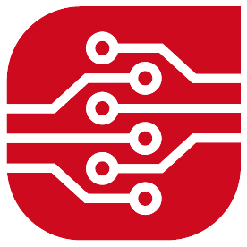

<!-- PROJECT LOGO AND TITLE-->
<h1 align="center">
   
  
   
  Automatisierung von Ausschreibungsprozessen von europaweiten Ausschriebungen
   
</h1>
<h4 align="center">In Zusammenarbeit mit der <a href="https://aura-gmbh.de/" target="_blank">Aura - Innovative Arbeitswelten</a>.</h4>

<!-- TABLE OF CONTENTS -->

  <a href="#ziel-des-Projekts">Ziel</a> •
  <a href="#Projektaufbau">Projektaufbau</a> •
  <a href="#Projektaufbau">Environment Variablen</a> •
  <a href="#contact">Contace</a> •
  <a href="#partner">Partner</a>

 

<!-- ZIEL DES PROJEKTS -->
<h1>Ziel des Projekts</h1>

Die Erstellung von Ausschreibungen für Büroeinrichtungen ist ein aufwendiger Prozess, der mit hohem Arbeitsaufwand und Fehlerpotenzial verbunden ist. Um diese Herausforderungen zu bewältigen, strebt Aura gemeinsam mit dem Mittelstand-Digitalzentrum Franken die Automatisierung von europaweiten Ausschreibungsprozessen mithilfe von KI an.

> **Das Projekt verfolgt dabei folgende Ziele:**
>
>Eine präzise Analyse und Dokumentation der Prozessschritte, die Identifikation sinnvoller Einsatzmöglichkeiten für KI, die Auswahl und Umsetzung geeigneter Lösungen mit Python sowie die Entwicklung eines Proof of Concepts für ein benutzerfreundliches Interface.

 

(<a href="#readme-top">back to top</a>)

<!-- AUFBAU DES PROJEKTS -->
<h1>Aufbau des Projekts</h1>

### Inhalt

<ol>
  <li>Explorative Analyse</li>
    <ol>
      <li><a href="Explore\Grundriss">Erfassung der Stückzahlen</a></li>
      <li><a href="Explore\Technischer_Vorbeschrieb">Erstellung des technischen Vorbeschriebs</a></li>
      <li><a href="Explore\Mengengeruest">Erstellung des Mengengerüsts</a></li>
    </ol>
  </li>
  <li>Erstellung eines benutzerfreundlichen User Interfaces
    <ol>
      <li><a href="#Aufruf-des-User-Interface">Aufruf des User Interface</a></li>
      <li><a href="my_app">Zum Code</a></li>
    </ol>
  </li>
</ol>

 

(<a href="#readme-top">back to top</a>)

<!-- Aufruf des User Interface -->
<h1>User Interfaces</h1>
Zur einfachen Interaktion mit den im backend erstellten automatisierungspipelines wurde ein nutzerfreundliches Userinterface erstellt.

 

(<a href="#readme-top">back to top</a>)

<!-- CONTACT -->
<h1>Contact</h1>

* 

    
  Vernetzt euch gerne mit uns auf <a href="https://linkedin.com/in/mittelstand-digital-zentrum-franken">LinkedIn</a>

* 

    
  Folgt uns gerne auf <a href="https://instagram.com/mittelstand_digital_franken">Instagram</a> um keine Neuigkeiten mehr zu verpassen

* 

    
  Alle neuen Infos, Projekte, Kurse und Blogbeiträge findet ihr auf unserer <a href="https://digitalzentrum-franken.de/">Webside</a>

* 

    
  Schreib uns eine Mail an <a href="mailto:info@digitalzentrum-franken.de">info@digitalzentrum-franken.de</a>

 

(<a href="#readme-top">back to top</a>)

<!-- PARTNER -->
<h1>Partner</h1>

 

(<a href="#readme-top">back to top</a>)

